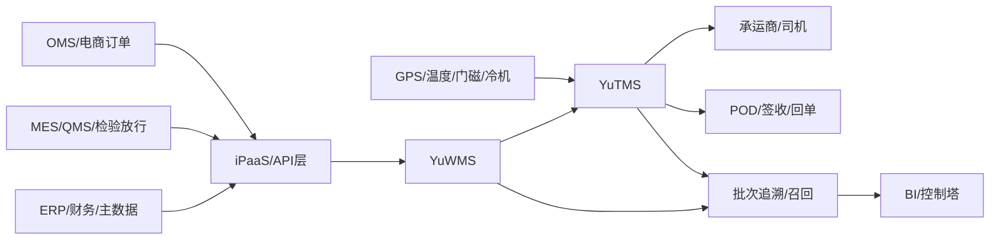

# 宠物食品行业 WMS/TMS 技术方案

版本：2026-06-05 第一版整合版

## 1. 结论

当前 YuWMS 已覆盖原料、包材、成品、备件、批次、效期、暂扣、盘点、标签、扫码、库位推荐、波次拣货、权限和日志。结合《宠物食品行业 WMS 与 TMS 的应用分析报告》，下一阶段重点不是继续堆 WMS 页面，而是把 WMS 的“库存作业真相”延伸为 TMS 的“运输执行真相”。

技术落地目标：

- WMS 继续作为库存、批次、效期、质量状态、库位、标签和出库作业的主系统。
- TMS 新增承运商、线路、运输计划、温控事件、POD 签收、运费结算和承运商绩效。
- 成品发货从 WMS 装车动作自动生成 TMS 运单，实现订单、批次、SSCC、车牌、司机、封签、温控和签收证据串联。
- 形成宠物食品行业需要的批次追溯、临期控制、冷链不断链、召回定位和运输费用闭环。

## 2. 当前系统差距

| 领域 | 当前已有 | 缺口 | 优先级 |
|---|---|---|---|
| WMS 批次/效期 | 已有 GoodsID、SSCC、BBD、质量状态、FEFO/FIFO 分配、渠道最小剩余效期规则 | 后续可接 OMS 自动带入渠道规则 | 中 |
| WMS 成品发货 | 已有发货通知、波次、合并拣货、复核、装车发货，装车后自动生成 TMS 运单和司机任务 | 后续接真实司机移动端 | 中 |
| 冷链/温控 | 已有库内临期和质量状态，TMS 已支持运输温度、湿度、开门、GPS/IoT 遥测和异常标记 | 后续接真实车载设备，并联动 WMS 复核冻结 | 高 |
| TMS | 已新增 TMS 数据模型、API、菜单、权限、导出、控制塔、司机协同、接口日志、审计包和 SOP 验收 | 后续接真实承运商 API | 中 |
| 费用 | 已支持独立运费账单、预估运费、实际运费、差异和对账状态 | 后续接 ERP 财务结算和承运商账单导入 | 中 |
| 承运商绩效 | 已有 OTIF、POD率、温控异常率、费用偏差率和评分 | 后续接运输控制塔和承运商月度报表 | 中 |
| 合规证据链 | WMS 操作日志已有，TMS 在途、签收、IoT、接口、召回和审计证据包已进入追溯链 | 后续增加电子签名和外部审计格式 | 中 |

## 3. 总体架构



边界定义：

- ERP：SKU、客户、供应商、财务口径、运输费用结算。
- MES/QMS：生产批次、检验、放行、冻结、召回指令。
- WMS：库存、库位、SSCC、批次、BBD、质量状态、标签、收发存。
- TMS：承运商、线路、车辆、司机、运单、温控、POD、费用、绩效。
- IoT：运输温湿度、GPS、开门、冷机状态。

## 4. WMS 增强方案

### 4.1 渠道效期规则

新增主数据维度：

| 字段 | 说明 |
|---|---|
| channel_code | 渠道编码，如 TMALL、JD、KA、EXPORT |
| goods_id | SKU |
| min_remaining_days | 发货时最小剩余保质期 |
| allow_near_expiry | 是否允许临期发货 |
| require_quality_release | 是否必须 QMS 放行 |

出库分配逻辑：

1. 先过滤质量状态，只允许合格库存。
2. 再按渠道最小剩余效期过滤 BBD。
3. 对温敏 SKU 强制 FEFO。
4. 如无可发库存，出库单进入欠品/效期不满足状态，不允许确认。

### 4.2 召回批次锁定

新增召回对象：

- recall_no
- goods_id
- supplier_batch / production_batch
- affected_sscc
- affected_outbound_orders
- affected_shipments
- status：草稿、已冻结、已通知、已完成

动作：

- WMS 批量冻结在库 SSCC。
- TMS 定位在途/已签收运单。
- 导出召回清单，包含客户、订单、承运商、车牌、POD。

### 4.3 WMS/TMS 装车交接

成品波次 `装车发货` 后触发：

- 生成 TMS 运单。
- 将 WMS 出库单、波次、SSCC、批次、BBD、客户、月台、车牌、司机、封签写入 TMS。
- 运单状态从 `待发车` 开始。

## 5. TMS 模块设计

左侧导航已新增 `TMS运输`，子菜单：

1. `控制塔`
2. `运输计划`
3. `在途温控`
4. `IoT/GPS`
5. `POD/运费`
6. `司机协同`
7. `外部接口`
8. `召回追溯`
9. `承运商绩效`
10. `审计包`
11. `承运商线路`

### 5.1 承运商主数据

核心字段：

| 字段 | 说明 |
|---|---|
| carrier_code | 承运商编码 |
| carrier_name | 承运商名称 |
| contact | 联系人 |
| phone | 联系方式 |
| service_type | 快递、零担、整车、冷链、同城 |
| cold_chain_capable | 是否支持冷链 |
| active | 是否启用 |
| score | 绩效分 |

### 5.2 线路与费率

核心字段：

| 字段 | 说明 |
|---|---|
| lane_code | 线路编码 |
| origin | 始发地 |
| destination | 目的地/区域 |
| carrier_code | 承运商 |
| transit_days | 标准时效 |
| temp_min/temp_max | 温控范围 |
| base_fee | 基础费 |
| fee_per_kg | 公斤费率 |
| fee_per_cbm | 体积费率 |
| fuel_surcharge | 燃油附加 |

### 5.3 运输计划/运单

状态流：

```text
待发车 -> 已发车 -> 在途 -> 到达 -> 已签收 -> 已对账
                 -> 异常 -> 关闭
```

核心字段：

| 字段 | 说明 |
|---|---|
| shipment_no | 运单号 |
| source_type | WMS波次 / 手工 / 退货 |
| source_id | WMS 出库单或波次 ID |
| carrier_code | 承运商 |
| vehicle_no | 车牌 |
| driver_name | 司机 |
| driver_phone | 司机电话 |
| seal_no | 封签号 |
| customer | 客户 |
| destination | 目的地 |
| planned_departure | 计划发车 |
| actual_departure | 实际发车 |
| eta | 预计到达 |
| actual_arrival | 实际到达 |
| temp_min/temp_max | 要求温度 |
| status | 运单状态 |

运单行字段：

- goods_id
- goods_name
- qty
- unit
- sscc
- lot_no
- bbd
- outbound_id
- wave_id

### 5.4 在途事件

事件类型：

- 发车
- GPS定位
- 温度上报
- 开门
- 延误
- 到达
- 签收
- 拒收
- 破损
- 温控异常

事件字段：

| 字段 | 说明 |
|---|---|
| event_time | 事件时间 |
| event_type | 事件类型 |
| location_text | 位置描述 |
| latitude/longitude | 坐标 |
| temperature | 温度 |
| humidity | 湿度 |
| door_open | 是否开门 |
| note | 备注 |
| operator | 操作人/来源 |

温控规则：

- 温度超过 `temp_min/temp_max` 自动生成高风险异常。
- 异常运单禁止直接对账，需要主管关闭异常。
- 若异常涉及温敏 SKU，回写 WMS 建议冻结或质量复核。

### 5.5 POD 签收

字段：

- signed_by
- signed_at
- received_qty
- damaged_qty
- shortage_qty
- pod_image_ref
- note

规则：

- `damaged_qty > 0` 或 `shortage_qty > 0` 时，运单进入异常。
- POD 完成后，OMS/ERP 可回写签收状态。
- POD 是召回与索赔的关键证据。

### 5.6 运费结算

字段：

- freight_bill_no
- shipment_no
- carrier_code
- estimated_fee
- actual_fee
- difference
- billing_status：待对账、差异、已确认、已结算
- exception_reason

计算逻辑：

```text
预估运费 = base_fee + weight * fee_per_kg + volume * fee_per_cbm + fuel_surcharge
差异 = 实际承运商账单 - 系统预估运费
```

权限：

- 仓库账号可查看运单，不可改费用。
- 运输账号可维护运单和 POD。
- 财务/主管可确认运费。
- admin 可关闭异常。

## 6. 建议数据库表

```sql
CREATE TABLE IF NOT EXISTS tms_carriers (
    id INTEGER PRIMARY KEY AUTOINCREMENT,
    carrier_code TEXT UNIQUE NOT NULL,
    carrier_name TEXT NOT NULL,
    contact TEXT,
    phone TEXT,
    service_type TEXT DEFAULT '零担',
    cold_chain_capable INTEGER DEFAULT 0,
    active INTEGER DEFAULT 1,
    score REAL DEFAULT 100,
    created_at TEXT NOT NULL,
    updated_at TEXT NOT NULL
);

CREATE TABLE IF NOT EXISTS tms_lanes (
    id INTEGER PRIMARY KEY AUTOINCREMENT,
    lane_code TEXT UNIQUE NOT NULL,
    origin TEXT NOT NULL,
    destination TEXT NOT NULL,
    carrier_code TEXT NOT NULL,
    transit_days INTEGER DEFAULT 1,
    temp_min REAL,
    temp_max REAL,
    base_fee REAL DEFAULT 0,
    fee_per_kg REAL DEFAULT 0,
    fee_per_cbm REAL DEFAULT 0,
    fuel_surcharge REAL DEFAULT 0,
    active INTEGER DEFAULT 1,
    created_at TEXT NOT NULL,
    updated_at TEXT NOT NULL
);

CREATE TABLE IF NOT EXISTS tms_shipments (
    id INTEGER PRIMARY KEY AUTOINCREMENT,
    shipment_no TEXT UNIQUE NOT NULL,
    source_type TEXT DEFAULT 'WMS',
    source_id TEXT,
    carrier_code TEXT,
    lane_code TEXT,
    customer TEXT,
    destination TEXT,
    vehicle_no TEXT,
    driver_name TEXT,
    driver_phone TEXT,
    seal_no TEXT,
    planned_departure TEXT,
    actual_departure TEXT,
    eta TEXT,
    actual_arrival TEXT,
    temp_min REAL,
    temp_max REAL,
    status TEXT DEFAULT '待发车',
    exception_flag INTEGER DEFAULT 0,
    exception_note TEXT,
    created_by TEXT,
    created_at TEXT NOT NULL,
    updated_at TEXT NOT NULL
);

CREATE TABLE IF NOT EXISTS tms_shipment_lines (
    id INTEGER PRIMARY KEY AUTOINCREMENT,
    shipment_no TEXT NOT NULL,
    outbound_id INTEGER,
    wave_id INTEGER,
    goods_id TEXT NOT NULL,
    goods_name TEXT,
    sscc TEXT,
    lot_no TEXT,
    bbd TEXT,
    qty REAL NOT NULL,
    unit TEXT
);

CREATE TABLE IF NOT EXISTS tms_events (
    id INTEGER PRIMARY KEY AUTOINCREMENT,
    shipment_no TEXT NOT NULL,
    event_time TEXT NOT NULL,
    event_type TEXT NOT NULL,
    location_text TEXT,
    latitude REAL,
    longitude REAL,
    temperature REAL,
    humidity REAL,
    door_open INTEGER DEFAULT 0,
    note TEXT,
    operator TEXT,
    risk_level TEXT DEFAULT '低'
);

CREATE TABLE IF NOT EXISTS tms_pods (
    id INTEGER PRIMARY KEY AUTOINCREMENT,
    shipment_no TEXT UNIQUE NOT NULL,
    signed_by TEXT NOT NULL,
    signed_at TEXT NOT NULL,
    received_qty REAL DEFAULT 0,
    damaged_qty REAL DEFAULT 0,
    shortage_qty REAL DEFAULT 0,
    pod_image_ref TEXT,
    note TEXT,
    created_by TEXT,
    created_at TEXT NOT NULL
);

CREATE TABLE IF NOT EXISTS tms_freight_bills (
    id INTEGER PRIMARY KEY AUTOINCREMENT,
    freight_bill_no TEXT UNIQUE NOT NULL,
    shipment_no TEXT NOT NULL,
    carrier_code TEXT,
    estimated_fee REAL DEFAULT 0,
    actual_fee REAL DEFAULT 0,
    difference REAL DEFAULT 0,
    billing_status TEXT DEFAULT '待对账',
    exception_reason TEXT,
    confirmed_by TEXT,
    confirmed_at TEXT,
    created_at TEXT NOT NULL,
    updated_at TEXT NOT NULL
);
```

## 7. 建议 API

| API | 方法 | 说明 | 权限 |
|---|---|---|---|
| `/api/tms/bootstrap` | GET | 返回承运商、线路、运单、异常、绩效概览 | tms/view |
| `/api/tms/carriers` | POST | 新增/更新承运商 | tms_admin |
| `/api/tms/lanes` | POST | 新增/更新线路费率 | tms_admin |
| `/api/tms/shipments` | POST | 手工创建运输单 | tms |
| `/api/tms/shipments/from-wms` | POST | 从 WMS 出库/波次生成运输单 | outbound/tms |
| `/api/tms/shipments/{no}/dispatch` | POST | 发车确认 | tms |
| `/api/tms/shipments/{no}/event` | POST | 上传在途/GPS/温度事件 | tms |
| `/api/tms/shipments/{no}/pod` | POST | POD 签收 | tms |
| `/api/tms/shipments/{no}/freight` | POST | 运费确认/对账 | tms_settle |
| `/api/export?dataset=tms_shipments` | GET | 导出运单 | tms/view |
| `/api/export?dataset=tms_events` | GET | 导出温控/在途事件 | tms/view |
| `/api/import?import_type=tms_events` | POST | 批量导入温控事件 | tms |

## 8. 前端页面

### 8.1 运输计划

显示：

- 待发车、在途、异常、待 POD、待对账数量。
- 运单列表：运单号、客户、承运商、车牌、司机、状态、ETA、异常。
- 操作：发车、上传事件、POD、关闭异常。

### 8.2 在途监控

显示：

- 最近 GPS/温度事件。
- 温控异常红色预警。
- 延误运单黄色预警。

### 8.3 POD 签收

显示：

- 待签收运单。
- 签收人、签收时间、实收数量、破损、短少、备注。
- 破损/短少自动转异常。

### 8.4 运费结算

显示：

- 系统预估运费、承运商账单、差异金额。
- 差异原因、确认人、确认时间。
- 仅主管/财务/admin 可确认。

### 8.5 承运商绩效

KPI：

- OTIF
- POD 及时率
- 温控异常率
- 运输费用偏差率
- 破损/短少率

## 9. SOP 验收新增项

新增自动验收步骤：

1. 管理员登录并重置账套。
2. 创建承运商和冷链线路。
3. 成品入库。
4. 成品发货通知。
5. 创建波次并完成合并拣货、订单复核、装车。
6. 系统从 WMS 波次生成 TMS 运单。
7. TMS 发车确认。
8. 上传正常温度事件，状态保持在途。
9. 上传超温事件，系统标记温控异常。
10. POD 签收，含短少/破损时进入异常。
11. 运费对账，仅主管/admin 可确认。
12. 导出 TMS 运单、事件、POD、运费。
13. 验证召回链路能定位到在库 SSCC 和已发运单。

验收输出应新增：

```text
- TMS承运商和线路主数据 OK
- WMS装车生成TMS运单 OK
- TMS发车和在途事件 OK
- TMS温控异常预警 OK
- POD签收和异常闭环 OK
- 运费结算权限 OK
- 批次召回定位到运单 OK
```

## 10. 实施顺序

第一阶段：TMS 最小闭环，已完成

- 数据表：tms_carriers、tms_lanes、tms_shipments、tms_shipment_lines、tms_events、tms_pods、tms_freight_bills、channel_expiry_rules、recall_orders。
- 权限：新增 tms、tms_admin、tms_settle。
- 后端 API：承运商、线路、渠道效期规则、运单、事件、POD、费用、绩效、召回。
- 前端菜单：TMS运输。
- WMS 联动：成品波次装车后生成运输单。
- SOP：补充 TMS 验收。

第二阶段：宠物食品强化，已完成第一版

- 渠道效期规则：已按 ECOM、DISTRIBUTOR、KA、EXPORT 初始化规则，成品发运会按渠道最小剩余效期过滤 BBD。
- 召回批次锁定和运单定位：已按 GoodsID + 批次冻结在库 SSCC，并记录命中运单。
- 承运商绩效看板：已生成 OTIF、POD率、温控异常率、费用偏差率和综合评分。
- 运输温控异常回写 WMS 质量复核：保留为下一阶段，可由 MES/QMS 指令或质量人员确认后冻结。

第三阶段：外部集成与控制塔，已完成程序版

- OMS/电商订单接口事件：可生成成品发运单并保留接口日志。
- ERP 运费结算接口事件：可回写实际运费、差异状态和账单。
- MES/QMS 放行/冻结/召回接口事件：可更新在库状态或生成召回单。
- GPS/温控 IoT 接口：可接收温度、湿度、位置、门磁、冷机状态和速度，并进入控制塔风险队列。
- 司机/承运商协同：自动派发司机任务，支持接单、发车、到达和签收状态回传。
- 审计证据包：可按运输单或批次打包运单、批次、事件、遥测、POD、运费和司机任务。

## 11. 当前执行状态

截至 2026-06-05，WMS/TMS 完整程序版已整合到原 YuWMS 主程序，不再使用独立 8780 端口程序。

已修改和验证的主文件：

- `modern_wms/app.py`：新增 TMS 表结构、演示主数据、权限、API、成品发货自动生成运单、控制塔、司机任务、IoT/GPS 遥测、外部接口日志、审计证据包、渠道效期拦截、温控事件、POD、独立运费账单、承运商绩效、召回冻结定位和 Excel 导出。
- `modern_wms/static/app.js`：新增左侧 `TMS运输` 模块和 `控制塔`、`运输计划`、`在途温控`、`IoT/GPS`、`POD/运费`、`司机协同`、`外部接口`、`召回追溯`、`承运商绩效`、`审计包`、`承运商线路` 子菜单。
- `modern_wms/sop_flow_test.py`：新增 TMS 运输执行、司机接单、IoT/GPS 超温、控制塔风险、POD、ERP 运费接口、独立运费账单、审计证据包、承运商绩效、渠道效期拦截和批次召回自动验收。
- `modern_wms/README.md`：启动和使用说明已改为原 YuWMS 集成版。

原系统访问地址保持不变：

```text
http://127.0.0.1:8765/
```

新增运输调度账号：

```text
tms / tms123
```

当前自动验收输出应包含：

```text
SOP_FLOW_TEST_PASS
- TMS承运商/线路/渠道效期规则 OK
- TMS司机任务自动派发/接单 OK
- TMS IoT/GPS温控自动接入 OK
- TMS运输执行/温控/POD/运费 OK
- TMS独立运费账单和承运商绩效 OK
- TMS外部接口日志和审计证据包 OK
- 批次召回定位到TMS运单 OK
- 渠道最小剩余效期拦截 OK
```

下一阶段建议：

- 接入真实 MES/QMS/OMS/ERP/承运商 API，替换当前程序版接口事件表单。
- 接入真实 GPS/温控 IoT、司机移动端和电子签名。
- 把控制塔扩展成月度承运商报表和异常闭环看板。
